# Broadmeadow Community Garden website
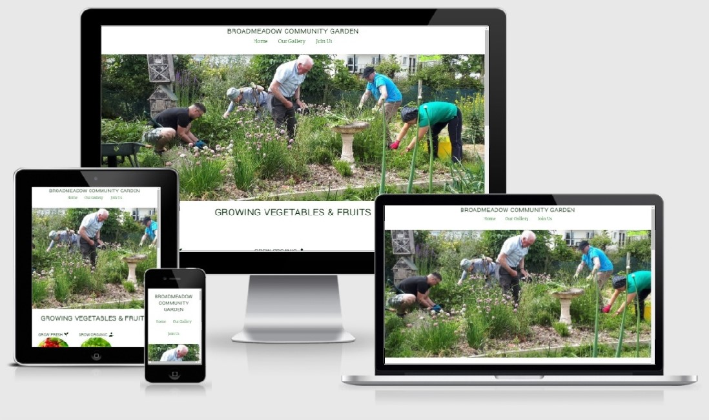

This project is for people who love to grow organic, fresh fruits and vegetables. Users will be able to find our location, will be able to see our gallery, days, and times when we are opened. 
  
This project is for educational purposes and can not be used as a template for a business use. The main aim is to build responsive website with HTML5 and CSS. 

## Website purposes
The reason to create this website is to help people how love grow organic food to get in touch with each other. This website is the best place for locals and for new members on how to find us and how to join us. 

## User goals
* user is able to find the location of the place and contact information.
* users can easily fill forms to join us.
* user is able to see what kind of veg and fruits we are groing in our community garden. 

## Surface

### Colors
Main colors used in a project
* body color: brown
* h1,h2 color: #22702
* h1 backgroun-color: #fff
* menu ul background-color: #fff
* circle-container border-color: #ccc
* signup-form color: #fff
* signup-form h2 color: #fafafa
* text-input color: #fafafa
* text-input border color: #fafafa

### Fonts
* body font-family is Merriweather and as a backup font sans serif
* h1,h2 font-family is Yantramanav

### Images
* I used my images from the gallery from Broadmeadow Community Garden.

## Feature
The website consist of 3 pages. Three are accessible from navigation menu.

The website has below features:

### Navigation bar
 * Navigation bar is visible on the top of each page of website. It is responsive and will adapt to mobile devices.
 * Navigation scheme:
    * In the centre there are three links. It contains: 
       * Home 
       * Our Gallery
       * Joun Us
### Footer
* It has social links in the center. Each link will open in a separate tab in a browser. Also has image of Dublin Airport Community Fund & image of Fingal County Council. Ech link will open in a separate tab in a Browser. 

## Home 
* Logo Broadmeadow Community garden. 
* Navigation menu.
* Hero image
  * Includes an image in the center.
* Logo: Growing vegetables and ftuits.
  * Includes three images with headings, Grow Fresh, Grow organic, Get Social. Under each image a text about how important to grow fresh, organic food, and how community garden is connecting people.
* Contact us
  * Includes times and days when community garden is opened. 
* Map
  * Location of community garden. 
* Footer
  * It has social links in the center. Each link will open in a separate tab in a browser. Also has image of Dublin Airport Community Fund & image of Fingal County Council. Ech link will open in a separate tab in a Browser.

## Our Gallery
* Logo Broadmeadow Community garden. 
* Navigation menu.
* Images from our Broadmeadow community garden, user can see what kind of veg and fruits we are groing. 
* Footer
  * It has social links in the center. Each link will open in a separate tab in a browser. Also has image of Dublin Airport Community Fund & image of Fingal County Council. Ech link will open in a separate tab in a Browser.

## Join Us
* Logo Broadmeadow Community garden. 
* Navigation menu.
* Image of raspberryberry andd in the middle from the left hand side is signup form with threee fields, Name, Surname, Email, and join us botton. New user can send his details. 
* Footer
  * It has social links in the center. Each link will open in a separate tab in a browser. Also has image of Dublin Airport Community Fund & image of Fingal County Council. Ech link will open in a separate tab in a Browser.

# Technologies used 

## HTML5
* As a structurel language.

## CSS
* As a style language. 

## Font Awesome
* As an icon library for a social links.

## Google Fonts
* As a font resource. 

## Git Hub
* As a As a software hosting platform to keep project in a remote location.

## Git 
* As a version-control system tracking.

## Git Pod
* As a development hosting platform. 
   
# Testing

## Functionality testing
* I used Chrome developer tools throughout the project for testing and solving problems with responsiveness and style issues.

## Compatibility testing
* Site was tested across multiple virtual mobile devices and browsers. I checked all supported devices in both Safari web developer tolls and Chrome developer tools.

# Issues found during site development
* Images Dublin Airport Community Fund and Fingal County Council was so big, first of all I applied inline rule in HTML5 after that Validator showed me an error. I deleted inline rule in html5 I created a class for both pictures "Footer-Logo" and in CSS I gived property and value for this that class. 
* Images "Grow Fresh" and "Grow Organic", "Get Social" was not responcive on iPad device and Mobile Devise, I create @ media screen for 1200px and down and @ media screen for 950px and down and @ media screen for 568 px and down.

# Performance testing
I run Lighthouse tool to check performance of the website. Screenshot is presented below:
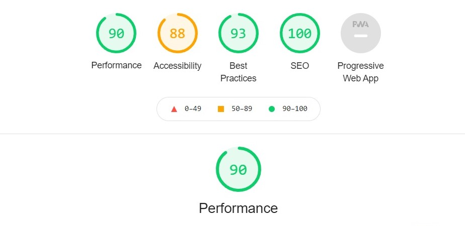

# Code Validation
* At the end of the project I used two websites to validate a code
* To validate CSS [https://jigsaw.w3.org/css-validator/validator]
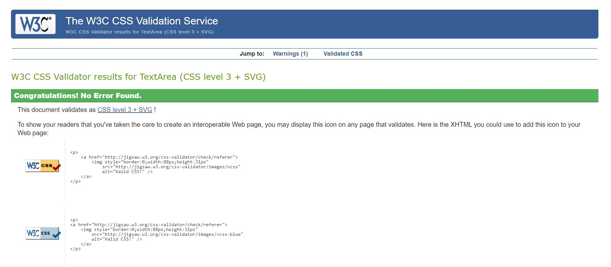
* To test HTML5 [https://validator.w3.org/nu/?doc=https%3A%2F%2Fcode-institute-org.github.io%2Flove-running-2.0%2Findex.html#textarea]
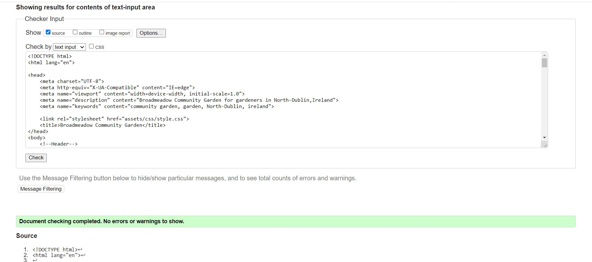

# Deployment
The project was deployed on GitHub Pages. I used Gitpod as a development environment where I commited all changes to git version control system. I used push command in Gitpod to save changes into GitHub.

To deploy a project I had to:

* Log in to GitHub and click on repository to deploy Broadmeadow Community garden [https://github.com/DublinSwords/Broadmeadow-Community-Garden-]
* select Settings and find Git Hub Pages section at the very bottom of the page. 
* from source select none and Broadmeadow Community garden branch.
* click save and page was deployed after auto refresh. 
My site is published at [ https://dublinswords.github.io/Broadmeadow-Community-Garden-/]

To run localy:

* Log in to GitHub and click on repository to download [https://github.com/DublinSwords/Broadmeadow-Community-Garden-]
* select Code and click Download 
* after download you can extract the file and use it in your local environment

Alternatively you can Clone [https://docs.github.com/en/repositories/creating-and-managing-repositories/cloning-a-repository] or Fork [https://docs.github.com/en/get-started/quickstart/fork-a-repo] this repository [https://github.com/DublinSwords/Broadmeadow-Community-Garden-] into your github account.

# Credits

* To complete this project I used Code Institute student template: [https://github.com/Code-Institute-Org/gitpod-full-template]
* Ideas and library: 
  * [https://www.w3schools.com/]

## Code from Love Running website

* Adopted most code from Love Running website.

## Map 

* [https://goo.gl/maps/5gCF1fCEpXWup5EJ8]

## Images

* Images from my gallery from Broadmeadow Community garden. 

# Project screenshots

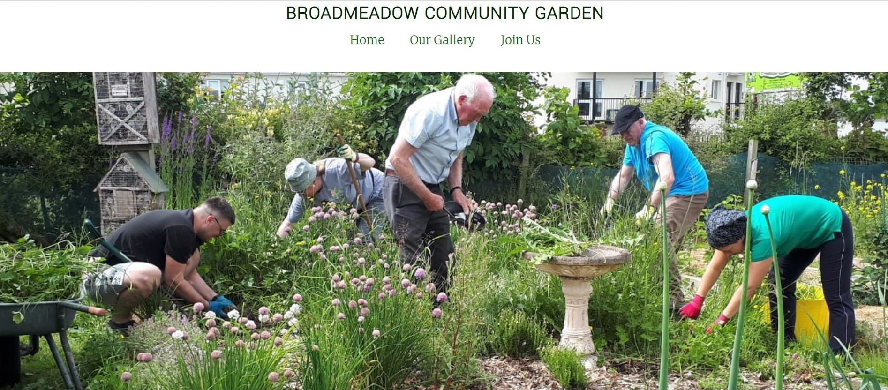
Users can see our members who working together.

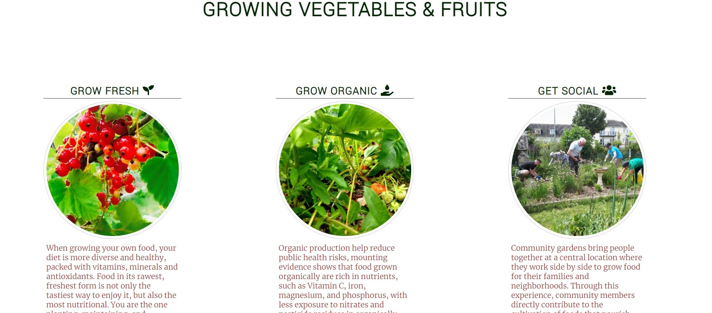
Users can see three pictures with explanation how important to grow fresh and organic food, and how important to be a part of community.

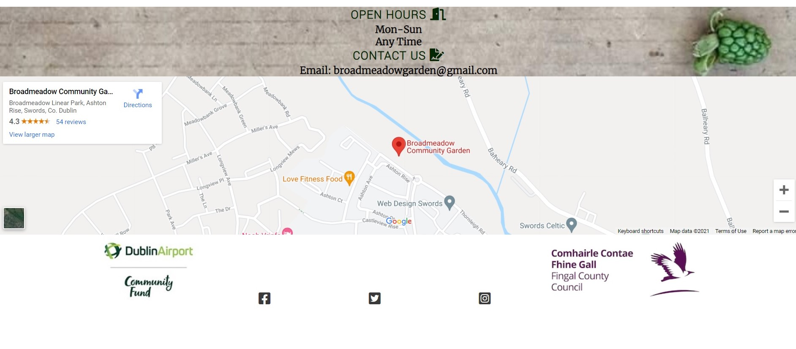
Users can easly find our location and days when we are opened. 

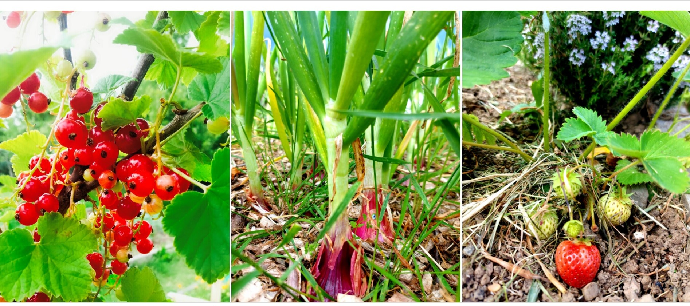
Users can see what kind of flowers, fruits and veg we are growing. 

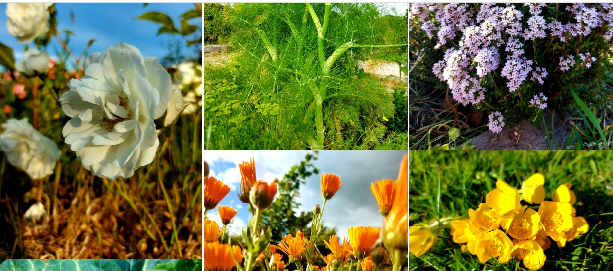
Users can see what kind of flowers, fruits and veg we are growing. 

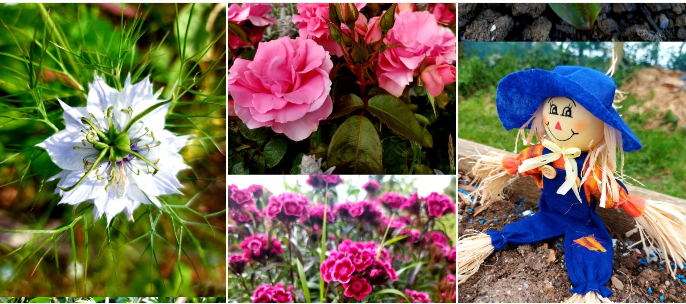
Users can see what kind of flowers, fruits and veg we are growing. 

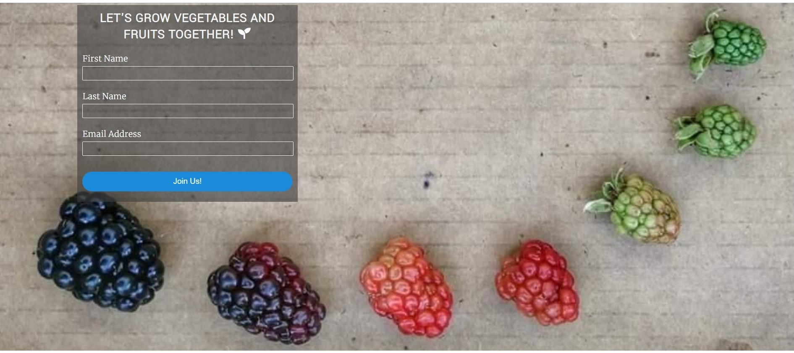
Users can fill join us form to become a new member. 